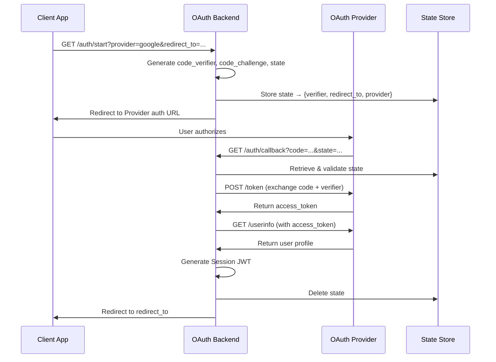

# Design Document

## Overview

The Quso OAuth Backend is a Node.js/Express server that implements OAuth 2.0 Authorization Code flow with PKCE for Google and GitHub identity providers. The system provides secure authentication for web and mobile clients, issues JWT-based session tokens, and follows security best practices including state parameter validation and PKCE to prevent authorization code interception attacks.

The architecture is modular, allowing easy addition of new OAuth providers through a plugin-like provider system. The backend acts as an intermediary between client applications and OAuth providers, handling the complex OAuth flow while exposing simple REST endpoints.

## Architecture

### High-Level Flow



### Component Architecture

The system is organized into distinct layers:

1. **HTTP Layer** (`server.ts`): Express server with middleware (CORS, cookie-parser)
2. **Authentication Layer** (`auth.ts`): OAuth flow orchestration
3. **Provider Layer** (`providers/`): Provider-specific implementations
4. **Security Layer** (`pkce.ts`, `jwt.ts`): Cryptographic operations
5. **Storage Layer**: In-memory state store (Redis in production)

## Components and Interfaces

### 1. PKCE Module (`pkce.ts`)

Handles PKCE cryptographic operations for secure OAuth flows.

```typescript
interface PKCEModule {
  generateCodeVerifier(): string;
  generateCodeChallenge(verifier: string): Promise<string>;
}
```

**Functions:**
- `generateCodeVerifier()`: Creates a 32-byte random string, base64url-encoded
- `generateCodeChallenge(verifier)`: Computes SHA256 hash of verifier, base64url-encoded
- `base64url(buffer)`: Converts Buffer to base64url format (RFC 7636)

### 2. JWT Module (`jwt.ts`)

Manages session token creation and verification.

```typescript
interface JWTModule {
  signSession(payload: object): string;
}

interface SessionPayload {
  sub: string;        // User identifier (provider:id)
  email: string | null;
  name: string;
  avatar: string | null;
  provider: string;
}
```

**Functions:**
- `signSession(payload)`: Signs JWT with HS256 algorithm using JWT_SECRET

### 3. Provider Interface

Each provider implements a consistent interface:

```typescript
interface OAuthProvider {
  name: string;
  authUrl: string;
  tokenUrl: string;
  userInfoUrl: string;
  clientId: string;
  clientSecret: string;
  scope: string;
  
  buildAuthParams(
    redirectUri: string,
    codeChallenge: string,
    state: string
  ): Record<string, string>;
  
  exchangeCode(
    code: string,
    redirectUri: string,
    codeVerifier: string
  ): Promise<TokenResponse>;
  
  getUser(accessToken: string): Promise<NormalizedUser>;
}

interface TokenResponse {
  access_token: string;
  token_type: string;
  expires_in?: number;
  id_token?: string;
  scope?: string;
}

interface NormalizedUser {
  id: string;
  email: string | null;
  name: string;
  avatar: string | null;
  provider: string;
}
```

### 4. Google Provider (`providers/google.ts`)

Implements OAuth 2.0 for Google:
- **Scopes**: `openid email profile`
- **Auth Method**: Authorization Code + PKCE (S256)
- **User ID Source**: `sub` field from userinfo
- **Token Exchange**: application/x-www-form-urlencoded POST

### 5. GitHub Provider (`providers/github.ts`)

Implements OAuth 2.0 for GitHub:
- **Scopes**: `read:user user:email`
- **Auth Method**: Authorization Code + PKCE (S256)
- **User ID Source**: `id` field from user API
- **Token Exchange**: application/x-www-form-urlencoded POST with Accept: application/json
- **Note**: Email may be null; requires separate /user/emails endpoint if needed

### 6. Authentication Module (`auth.ts`)

Core OAuth flow orchestration.

```typescript
interface StateStore {
  codeVerifier: string;
  redirectTo: string;
  provider: string;
}

interface AuthModule {
  startAuth(req: Request, res: Response): Promise<void>;
  handleCallback(req: Request, res: Response): Promise<void>;
  isAllowedRedirect(url: string): boolean;
}
```

**Functions:**

- `startAuth(req, res)`:
  1. Validates provider and redirect_to parameters
  2. Generates state, code_verifier, code_challenge
  3. Stores state mapping in StateStore
  4. Redirects to provider's authorization URL

- `handleCallback(req, res)`:
  1. Extracts code and state from query parameters
  2. Validates state against StateStore
  3. Exchanges authorization code for access token
  4. Fetches user profile from provider
  5. Issues Session JWT
  6. Redirects to client with token in URL fragment
  7. Cleans up state from store

- `isAllowedRedirect(url)`:
  - Validates redirect URL against ALLOWED_REDIRECTS whitelist

### 7. Server Module (`server.ts`)

Express application setup and routing.

```typescript
interface ServerConfig {
  PORT: number;
  BASE_URL: string;
  ALLOWED_REDIRECTS: string[];
  JWT_SECRET: string;
  JWT_EXPIRES: string;
}
```

**Routes:**
- `GET /auth/start`: Initiates OAuth flow
- `GET /auth/callback`: Handles provider callback
- `GET /health`: Health check endpoint

**Middleware:**
- CORS: Allows all origins with credentials (restrict in production)
- Cookie Parser: Parses cookies for potential cookie-based sessions
- Body Parser: Built-in Express JSON parser

## Data Models

### State Store Entry

```typescript
interface StateEntry {
  codeVerifier: string;    // PKCE code verifier
  redirectTo: string;      // Client callback URL
  provider: string;        // Provider name (google/github)
  createdAt?: number;      // Timestamp for TTL (optional)
}
```

**Storage:** In-memory Map (development), Redis (production)
**TTL:** 10 minutes (recommended for production)
**Key:** Random state parameter (32 hex characters)

### Session JWT Payload

```typescript
interface SessionJWT {
  sub: string;             // User ID: "provider:providerUserId"
  email: string | null;    // User email
  name: string;            // Display name
  avatar: string | null;   // Avatar URL
  provider: string;        // Provider name
  iat: number;             // Issued at (added by JWT library)
  exp: number;             // Expiration (added by JWT library)
}
```

### Environment Configuration

```typescript
interface EnvironmentConfig {
  // Server
  PORT: string;
  BASE_URL: string;
  ALLOWED_REDIRECTS: string;  // Comma-separated
  
  // JWT
  JWT_SECRET: string;
  JWT_EXPIRES: string;
  
  // Google
  GOOGLE_CLIENT_ID: string;
  GOOGLE_CLIENT_SECRET: string;
  GOOGLE_AUTH_URL: string;
  GOOGLE_TOKEN_URL: string;
  GOOGLE_USERINFO_URL: string;
  
  // GitHub
  GITHUB_CLIENT_ID: string;
  GITHUB_CLIENT_SECRET: string;
  GITHUB_AUTH_URL: string;
  GITHUB_TOKEN_URL: string;
  GITHUB_USERINFO_URL: string;
}
```

## Correctness Properties

*A property is a characteristic or behavior that should hold true across all valid executions of a system—essentially, a formal statement about what the system should do. Properties serve as the bridge between human-readable specifications and machine-verifiable correctness guarantees.*


### Property 1: PKCE code verifier format

*For any* generated code verifier, it should be a base64url-encoded string representing 32 random bytes (43 characters without padding)
**Validates: Requirements 2.1**

### Property 2: PKCE code challenge correctness

*For any* code verifier, the generated code challenge should equal the base64url-encoded SHA256 hash of that verifier
**Validates: Requirements 2.2**

### Property 3: Base64url encoding format

*For any* buffer encoded as base64url, the result should contain only characters from [A-Za-z0-9_-] with no padding equals signs
**Validates: Requirements 2.5**

### Property 4: State parameter uniqueness and format

*For any* two consecutive OAuth flow initiations, the generated state parameters should be unique 32-character hexadecimal strings
**Validates: Requirements 3.1**

### Property 5: State storage completeness

*For any* stored state entry, it should contain all required fields: codeVerifier, redirectTo, and provider
**Validates: Requirements 3.2**

### Property 6: State validation

*For any* callback with a state parameter, it should be accepted if and only if that state exists in the store
**Validates: Requirements 3.3**

### Property 7: State cleanup after callback

*For any* successfully processed callback, the corresponding state should no longer exist in the store
**Validates: Requirements 3.5**

### Property 8: Redirect URL validation

*For any* redirect URL provided to /auth/start, it should be accepted if and only if it appears in the ALLOWED_REDIRECTS list
**Validates: Requirements 1.3**

### Property 9: Authorization URL construction

*For any* valid OAuth flow initiation, the redirect URL to the provider should contain code_challenge, code_challenge_method=S256, and state parameters
**Validates: Requirements 1.2, 2.3**

### Property 10: Token exchange request completeness

*For any* authorization code exchange, the request should include code, code_verifier, client_id, client_secret, redirect_uri, and grant_type=authorization_code
**Validates: Requirements 4.2, 2.4**

### Property 11: User profile normalization

*For any* provider user profile response, the normalized user object should contain exactly these fields: id, email, name, avatar, provider
**Validates: Requirements 5.5**

### Property 12: Bearer token format

*For any* userinfo request, the Authorization header should be formatted as "Bearer {access_token}"
**Validates: Requirements 5.2**

### Property 13: Session JWT payload completeness

*For any* successful authentication, the issued JWT payload should contain sub, email, name, avatar, and provider fields
**Validates: Requirements 6.1**

### Property 14: User identifier format

*For any* created user identifier, it should match the pattern "{provider}:{providerUserId}"
**Validates: Requirements 6.4**

### Property 15: JWT signature verification

*For any* issued Session JWT, it should be verifiable using the configured JWT_SECRET
**Validates: Requirements 6.2**

### Property 16: Redirect with token in fragment

*For any* successful authentication, the final redirect URL should contain the JWT in the URL fragment as #token={jwt}
**Validates: Requirements 6.5**

### Property 17: Provider interface compliance

*For any* registered provider, it should implement all required methods: buildAuthParams, exchangeCode, and getUser
**Validates: Requirements 8.1**

### Property 18: Provider lookup

*For any* provider name in the registry, looking it up should return a provider object; for any name not in the registry, it should return undefined or throw an error
**Validates: Requirements 8.2**

### Property 19: Comma-separated redirect parsing

*For any* comma-separated string of URLs, parsing it should produce an array where each element is a trimmed URL
**Validates: Requirements 7.2**

## Error Handling

### Error Categories

1. **Client Errors (4xx)**
   - Invalid provider name → 400 Bad Request
   - Invalid redirect_to URL → 400 Bad Request
   - Invalid state parameter → 400 Bad Request
   - Missing required parameters → 400 Bad Request

2. **Provider Errors (varies)**
   - Provider returns error in callback → Pass through error to client
   - Token exchange fails → 500 Internal Server Error with error details
   - Userinfo request fails → 500 Internal Server Error with error details

3. **Server Errors (5xx)**
   - Missing environment variables → Fail to start with error message
   - JWT signing fails → 500 Internal Server Error
   - State store unavailable → 500 Internal Server Error

### Error Response Format

All errors should return a simple text or JSON response:

```typescript
// Text response for simple errors
res.status(400).send("Invalid redirect_to");

// JSON response for detailed errors (optional)
res.status(500).json({
  error: "token_exchange_failed",
  message: "Failed to exchange authorization code",
  details: providerError
});
```

### Error Handling Strategy

1. **Validation Errors**: Fail fast at the start of request handlers
2. **Provider Errors**: Catch axios errors and extract meaningful messages
3. **State Errors**: Always clean up state on errors to prevent leaks
4. **Logging**: Log all errors with context (provider, state, user ID if available)

### Security Considerations

- Never expose JWT_SECRET in error messages
- Never expose client secrets in logs or responses
- Sanitize provider error messages before returning to client
- Rate limit /auth/start to prevent state store exhaustion
- Implement state TTL to prevent indefinite storage growth

## Testing Strategy

### Unit Testing

The system will use **Jest** as the testing framework for unit tests. Unit tests will focus on:

1. **PKCE Functions**
   - Test code verifier generation produces valid base64url strings
   - Test code challenge correctly hashes verifiers
   - Test base64url encoding handles special characters

2. **JWT Functions**
   - Test JWT signing with valid payloads
   - Test JWT includes correct expiration
   - Test default expiration when not configured

3. **Provider Modules**
   - Test Google provider has correct scopes and URLs
   - Test GitHub provider has correct scopes and URLs
   - Test buildAuthParams includes all required parameters
   - Test user profile normalization for each provider

4. **Auth Module**
   - Test redirect URL validation with whitelist
   - Test state storage and retrieval
   - Test error handling for invalid states
   - Test cleanup after successful callback

5. **Integration Tests**
   - Test full OAuth flow with mocked provider responses
   - Test /health endpoint returns 200
   - Test CORS headers are present

### Property-Based Testing

The system will use **fast-check** as the property-based testing library for TypeScript. Property-based tests will verify universal properties across many randomly generated inputs.

**Configuration:**
- Each property test should run a minimum of 100 iterations
- Each test must include a comment tag referencing the design document property
- Tag format: `// Feature: quso-oauth-backend, Property {number}: {property_text}`

**Property Tests:**

1. **PKCE Properties**
   - Property 1: Code verifier format (100+ random generations)
   - Property 2: Code challenge correctness (100+ random verifiers)
   - Property 3: Base64url encoding (100+ random buffers)

2. **State Properties**
   - Property 4: State uniqueness (100+ generations)
   - Property 5: State storage completeness (100+ state entries)
   - Property 6: State validation (100+ valid/invalid states)
   - Property 7: State cleanup (100+ callbacks)

3. **Validation Properties**
   - Property 8: Redirect URL validation (100+ URLs)
   - Property 19: Comma-separated parsing (100+ strings)

4. **OAuth Flow Properties**
   - Property 9: Authorization URL construction (100+ flows)
   - Property 10: Token exchange completeness (100+ exchanges)
   - Property 11: User profile normalization (100+ profiles)
   - Property 12: Bearer token format (100+ tokens)

5. **JWT Properties**
   - Property 13: JWT payload completeness (100+ authentications)
   - Property 14: User identifier format (100+ users)
   - Property 15: JWT signature verification (100+ JWTs)
   - Property 16: Redirect with token (100+ redirects)

6. **Provider Properties**
   - Property 17: Provider interface compliance (all providers)
   - Property 18: Provider lookup (100+ lookups)

### Test Organization

```
tests/
├── unit/
│   ├── pkce.test.ts
│   ├── jwt.test.ts
│   ├── providers/
│   │   ├── google.test.ts
│   │   └── github.test.ts
│   └── auth.test.ts
├── property/
│   ├── pkce.property.test.ts
│   ├── state.property.test.ts
│   ├── validation.property.test.ts
│   ├── oauth-flow.property.test.ts
│   ├── jwt.property.test.ts
│   └── provider.property.test.ts
└── integration/
    └── server.integration.test.ts
```

### Mocking Strategy

- **Provider HTTP Calls**: Mock axios requests to provider endpoints
- **State Store**: Use in-memory Map for tests (same as development)
- **Environment Variables**: Use test-specific .env or process.env overrides
- **Time**: Mock Date.now() for JWT expiration tests

### Test Coverage Goals

- Unit test coverage: 80%+ for all modules
- Property test coverage: All 19 correctness properties implemented
- Integration test coverage: All HTTP endpoints tested

## Deployment Considerations

### Production Recommendations

1. **State Storage**: Replace in-memory Map with Redis
   - Implement TTL (10 minutes recommended)
   - Enable persistence for Redis
   - Use Redis Cluster for high availability

2. **CORS Configuration**: Restrict allowed origins
   ```typescript
   cors({
     origin: process.env.ALLOWED_ORIGINS.split(','),
     credentials: true
   })
   ```

3. **Rate Limiting**: Add rate limiting to prevent abuse
   ```typescript
   import rateLimit from 'express-rate-limit';
   
   const authLimiter = rateLimit({
     windowMs: 15 * 60 * 1000, // 15 minutes
     max: 10 // 10 requests per window
   });
   
   app.get('/auth/start', authLimiter, startAuth);
   ```

4. **HTTPS**: Always use HTTPS in production
   - Set `secure: true` on cookies
   - Update BASE_URL to use https://

5. **Logging**: Implement structured logging
   - Use Winston or Pino
   - Log all OAuth events (start, callback, errors)
   - Never log secrets or tokens

6. **Monitoring**: Add health checks and metrics
   - Monitor /health endpoint
   - Track OAuth success/failure rates
   - Alert on high error rates

7. **Database Integration**: Store users in database
   - Upsert user on successful authentication
   - Store provider ID mapping
   - Track last login timestamp

### Environment Variables Checklist

Required for production:
- [ ] PORT
- [ ] BASE_URL (https)
- [ ] ALLOWED_REDIRECTS (production URLs)
- [ ] JWT_SECRET (strong random string)
- [ ] JWT_EXPIRES
- [ ] GOOGLE_CLIENT_ID
- [ ] GOOGLE_CLIENT_SECRET
- [ ] GITHUB_CLIENT_ID
- [ ] GITHUB_CLIENT_SECRET
- [ ] REDIS_URL (if using Redis)
- [ ] ALLOWED_ORIGINS (for CORS)

### Security Checklist

- [ ] JWT_SECRET is cryptographically random (32+ bytes)
- [ ] HTTPS enabled for all endpoints
- [ ] CORS restricted to known origins
- [ ] Rate limiting enabled
- [ ] State TTL configured (10 minutes)
- [ ] Secrets not logged or exposed in errors
- [ ] Client secrets stored securely (not in code)
- [ ] PKCE enabled for all providers
- [ ] State parameter validated on all callbacks

## Future Enhancements

1. **Additional Providers**: Add support for Microsoft, Apple, Twitter
2. **Refresh Tokens**: Store and use refresh tokens for long-lived sessions
3. **Session Management**: Add /auth/logout and /auth/refresh endpoints
4. **User Database**: Integrate with PostgreSQL or MongoDB for user storage
5. **Email Verification**: Add email verification flow for providers without verified emails
6. **Multi-Factor Authentication**: Add optional MFA layer
7. **Audit Logging**: Log all authentication events for security audits
8. **Admin Dashboard**: Build admin UI for monitoring OAuth flows
9. **Webhook Support**: Notify client apps of authentication events
10. **Token Revocation**: Implement token revocation endpoint
